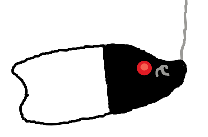

# JAHA

JAHA (**JA**va **H**ooking **A**gent) is a Java library for building Java agents that hook methods at runtime while
preserving access to original method behavior.



## Requirements

- **Java 8** (project targets Java 8 for compatibility)
- **Zig installed** (required for cross-platform building)

---

## Example

Below is an example of hooking `Integer.toString()`.

### Agent entrypoint

```java
import java.lang.instrument.Instrumentation;

import me.exeos.jaha.Jaha;

public final class AgentMain {

    public static void premain(String args, Instrumentation inst) {
        // Register hook classes
        Jaha.register(ToStringHook.class);

        // Apply hooks
        Jaha.load(inst);
    }
}
```

### Hook class

```java
import me.exeos.jaha.Jaha;
import me.exeos.jaha.annotations.Apply;
import me.exeos.jaha.annotations.Hook;

@Hook(target = "java/lang/Integer")
public class ToStringHook {

    @Apply
    public String toString() {
        String original = (String) Jaha.callOriginalObjectMethod();
        return "This has been hooked: " + original;
    }
}

```

### Output

Let's say you attach the example to this Program:

```java
import java.util.Random;

public class Main {

    public static void main(String[] args) {
        System.out.println(new Integer(new Random().nextInt()));
    }
}
```

The result would be:

```
This has been hooked: -1604796949
```

---

## License

This project is [LICENSED](./LICENSE) under the **GPL-3.0**.

---
